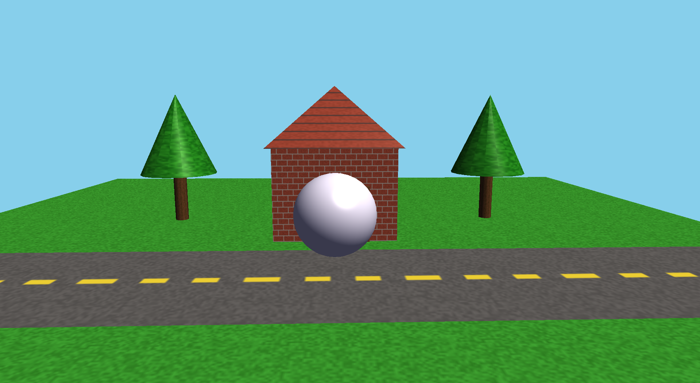

# Modular 3D OpenGL Rendering Pipeline

<!-- Replace the image below with your screenshot -->

## Overview
A zero-dependency (excluding OpenGL/GLFW) 3D graphics rendering engine built from scratch in C++. This project demonstrates a deep understanding of low-level systems engineering, the OpenGL graphics pipeline, and applied linear algebra. 

Instead of relying on external math libraries or asset loaders, this engine features a custom-built 4x4 matrix mathematics system, procedurally generated textures, and a highly modular rendering architecture.

## Key Features
* **Custom Linear Algebra Engine**: Hand-rolled column-major `Mat4`, `Vec3`, and `Vec2` implementations supporting affine transformations, perspective projection, and spherical coordinate look-at cameras without `GLM`.
* **Modular Rendering Architecture**: Clean abstraction of OpenGL state machines. Features decoupled subsystems for `Camera`, `Shader`, `Texture`, and `Mesh` data streams (VAO/VBO/EBO management).
* **Blinn-Phong Illumination**: Custom GLSL vertex and fragment shaders implementing a Blinn-Phong reflection model (Ambient + Diffuse + Specular) with directional sunlight and correct normal matrix transformations.
* **Procedural Asset Generation**: 100% procedurally generated textures (wood, brick, grass, asphalt) utilizing CPU-side bitwise hashing and noise algorithms mapped to custom 3D primitive geometries.

## Architecture
The engine is structured into distinct, decoupled components:
- `Geometry.h`: The core math and vertex structure foundation.
- `Camera`: Spherical coordinate orbit camera with mouse-look and smooth zoom.
- `Shader`: GLSL program compilation, linking, and uniform state management.
- `Mesh & Primitives`: Abstract vertex buffer management extended by discrete geometric shapes (`Cube`, `Pyramid`, `Cylinder`, `Cone`, `Plane`) with procedurally generated per-face normals.
- `Texture`: CPU-side rasterization and procedural noise generation mapped to OpenGL texture objects.

## Build Instructions
This project is configured to build using `g++` via VS Code tasks.

1. Ensure you have MinGW/GCC (g++) installed and configured in your PATH.
2. Open the project in Visual Studio Code.
3. Run the default build task (`Ctrl+Shift+B` or `Terminal -> Run Build Task`).
4. Execute the compiled `main.exe` located in the root directory.

*Dependencies:* GLAD and GLFW3 (Headers and libraries are included in the `Dependencies` folder).

## Controls
- **W, A, S, D**: Move camera (Forward, Left, Backward, Right).
- **Mouse Move**: Look around (FPS-style free-flying camera).
- **+ / - (or = / -)**: Zoom in and out.
- **R**: Toggle automatic scene rotation.
- **ESC**: Exit the application.

## Demo Walkthrough
<!-- Replace the link below with your video walkthrough or a high-quality GIF -->

